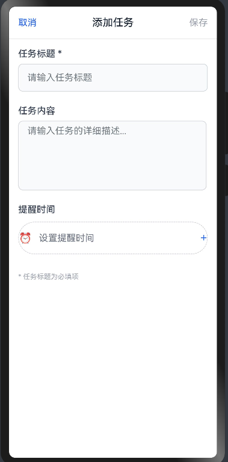

### 轻清单--待办清单应用（ArkTS 鸿蒙应用）
.png)

一个使用 ArkTS语言开发的 HarmonyOS 本地待办事项应用，支持任务的添加、编辑、完成、删除，**完全离线运行**，无需网络或服务器支持。

## 📱 应用功能

- ✅ 添加待办任务（标题 + 可选内容 + 可选提醒时间）
- ✏️ 编辑已存在任务
- ❌ 删除任务（支持滑动删除）
- ✔️ 勾选标记任务是否完成
- 💾 本地数据存储（无需网络/云端）
- 📊 简单任务统计（总数、已完成）

## 🛠 技术栈

没有人能够熄灭满天的星光！
- HarmonyOS NEXT
- ArkTS (eTS)
- DevEco Studio
- `@ohos.data.preferences` 本地存储模块

## 📂 项目结构

```
entry/
└── src/
└── main/
└── ets/
├── Index.ets // 应用首页，任务列表展示与交互
├── AddTask.ets // 添加任务页面
└── EditTask.ets // 编辑任务页面
```

## 💾 数据存储说明

使用 `preferences` 模块进行本地键值对数据持久化：

```typescript
interface TodoItem {
  id: string;
  title: string;
  content?: string;
  createdAt: number;
  dueTime?: number;
  isDone: boolean;
}
```

存储格式为 JSON 字符串，key 为 `"todo_list"`。

## 🧪 使用说明

1. 使用 DevEco Studio 打开项目。
2. 编译并运行至支持 ArkTS 的真机或模拟器。
3. 任务将自动保存在本地，不会丢失。

## 📌 开发者说明

- 不包含后端服务。
- UI 设计简洁，便于二次开发扩展。
- 可拓展功能：任务提醒通知、标签分类、数据导出等。

## 📷 应用截图

####  首页             

#### 添加事件页面

